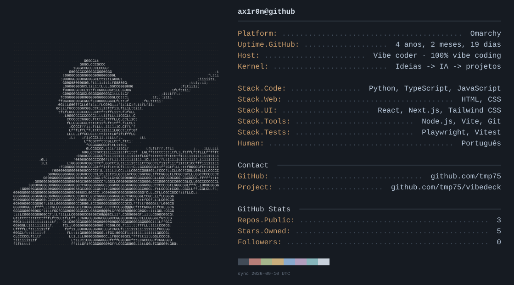

<!-- Generated by scripts/update_profile.py. Edit profile.json to customize. -->
<picture>
  <source media="(max-width: 600px)" srcset="assets/neofetch-mobile.svg">
  
</picture>

[VibeDeck](https://github.com/tmp75/vibedeck)

<details>
<summary>Versão em texto</summary>

```text
ax1r0n@github
Platform: Windows
Uptime.GitHub: 4 anos, 2 meses, 19 dias
Host: VibeDeck
Kernel: Local project tools
Code.Projects: JavaScript
Web.Projects: HTML, CSS
Runtime: Node.js
Human: Português
Contact
GitHub: github.com/tmp75
Project: github.com/tmp75/vibedeck
GitHub Stats
Repos.Public: 2
Stars.Owned: 5
Followers: 0
```

</details>
